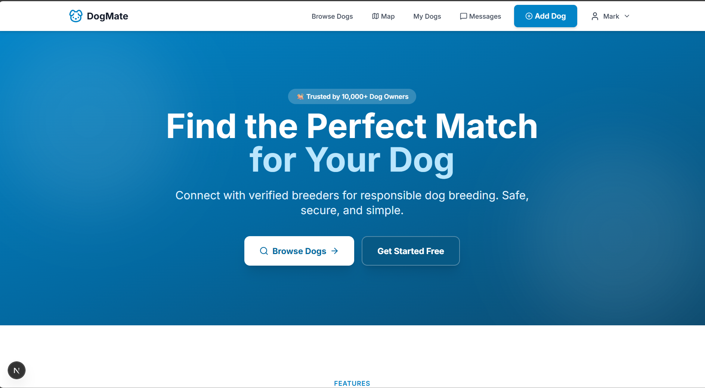

# 🐕 PawMatch - Dog Breeding Platform (Frontend)

A modern, responsive web application for connecting dog owners and breeders. Built with Next.js 14, TypeScript, and Tailwind CSS.



## 📋 Table of Contents

- [Features](#features)
- [Tech Stack](#tech-stack)
- [Prerequisites](#prerequisites)
- [Getting Started](#getting-started)
- [Project Structure](#project-structure)
- [Environment Variables](#environment-variables)
- [Available Scripts](#available-scripts)
- [Key Components](#key-components)
- [State Management](#state-management)
- [API Integration](#api-integration)
- [Styling](#styling)
- [Testing](#testing)
- [Deployment](#deployment)
- [Contributing](#contributing)
- [License](#license)

## Features

### User Features

- 🔐 **Authentication** - Register, login, and secure session management
- 🐕 **Dog Profiles** - Create and manage detailed dog listings
- 🔍 **Advanced Search** - Filter dogs by breed, gender, age, location
- 🗺️ **Map View** - Interactive map showing dogs in your area
- 💬 **Real-time Messaging** - Chat with other dog owners
- 💕 **Match Finding** - AI-powered breeding match suggestions
- 📱 **Responsive Design** - Works on all devices

### Technical Features

- ⚡ **Server-Side Rendering** - Fast initial page loads
- 🔄 **Real-time Updates** - Socket.io integration for live messaging
- 📍 **Geolocation** - Location-based search and mapping
- 🖼️ **Image Optimization** - Next.js Image component for optimized images
- 🎨 **Modern UI** - Beautiful, accessible components
- 🔒 **Type Safety** - Full TypeScript support

## Tech Stack

| Technology | Purpose |
| ------------ | ------------ |
| Next.js 14 | React framework with App Router |
| TypeScript | Type-safe JavaScript |
| Tailwind CSS | Utility-first CSS framework |
| Zustand | Lightweight state management |
| React Hook Form | Form handling |
| Zod | Schema validation |
| Axios | HTTP client |
| Socket.io Client | Real-time communication |
| Leaflet | Interactive maps |
| Lucide React | Icon library |
| React Hot Toast | Toast notifications |
| date-fns | Date formatting |

## Prerequisites

- **Node.js** >= 18.0.0
- **npm** >= 9.0.0 or **yarn** >= 1.22.0 or **pnpm** >= 8.0.0
- **Backend API** running (see backend README)

## Getting Started

### 1. Clone the repository

```bash
git clone https://github.com/yourusername/pawmatch-frontend.git
cd pawmatch-frontend
2. Install dependencies
bash
npm install
# or
yarn install
# or
pnpm install
3. Set up environment variables
bash
cp .env.example .env.local
Edit .env.local with your configuration (see Environment Variables).

4. Run the development server
bash
npm run dev
# or
yarn dev
# or
pnpm dev
Open http://localhost:3000 in your browser.
```

## Project Structure

```text
pawmatch-frontend/
├── app/                          # Next.js App Router
│   ├── (auth)/                   # Authentication routes (login, register)
│   │   ├── login/
│   │   │   └── page.tsx
│   │   ├── register/
│   │   │   └── page.tsx
│   │   └── layout.tsx
│   ├── (main)/                   # Main application routes
│   │   ├── browse/
│   │   │   └── page.tsx          # Dog browsing page
│   │   ├── dashboard/
│   │   │   ├── page.tsx          # User dashboard
│   │   │   ├── add-dog/
│   │   │   │   └── page.tsx      # Add new dog form
│   │   │   └── layout.tsx
│   │   ├── dogs/
│   │   │   ├── [id]/
│   │   │   │   ├── page.tsx      # Dog profile page
│   │   │   │   ├── edit/
│   │   │   │   │   └── page.tsx  # Edit dog page
│   │   │   │   └── matches/
│   │   │   │       └── page.tsx  # Dog matches page
│   │   │   └── page.tsx
│   │   ├── messages/
│   │   │   └── page.tsx          # Messaging center
│   │   ├── profile/
│   │   │   └── page.tsx          # User profile
│   │   └── layout.tsx
│   ├── globals.css               # Global styles
│   ├── layout.tsx                # Root layout
│   └── page.tsx                  # Home page
├── components/                   # React components
│   ├── auth/                     # Authentication components
│   ├── dog/                      # Dog-related components
│   ├── layout/                   # Layout components
│   ├── map/                      # Map components
│   ├── matching/                 # Matching components
│   ├── messages/                 # Messaging components
│   └── ui/                       # Reusable UI components
├── hooks/                        # Custom React hooks
│   └── useFetch.ts               # Data fetching hook
├── lib/                          # Library code
│   ├── api/                      # API client modules
│   ├── hooks/                    # Custom hooks
│   ├── store/                    # Zustand stores
│   ├── utils/                    # Utility functions
│   └── validations/              # Zod schemas
├── public/                       # Static assets
├── types/                        # TypeScript types
├── .env.example                  # Example environment variables
├── .eslintrc.json                # ESLint configuration
├── next.config.js                # Next.js configuration
├── package.json                  # Dependencies and scripts
├── tailwind.config.ts            # Tailwind CSS configuration
└── tsconfig.json                 # TypeScript configuration
```

## Environment Variables

Create a .env.local file in the root directory:

```bash

env

# API Configuration

NEXT_PUBLIC_API_URL=http://localhost:5000/api
NEXT_PUBLIC_SOCKET_URL=http://localhost:5000

# App Configuration
NEXT_PUBLIC_APP_NAME=PawMatch
NEXT_PUBLIC_APP_URL=http://localhost:3000

# Feature Flags (optional)
NEXT_PUBLIC_ENABLE_MAP=true
NEXT_PUBLIC_ENABLE_MATCHING=true

# Analytics (optional)
NEXT_PUBLIC_GA_ID=G-XXXXXXXXXX
```

```text

Variable                    Description               Required
NEXT_PUBLIC_API_URL         Backend API base URL      Yes
NEXT_PUBLIC_SOCKET_URL      Socket.io server URL      Yes
NEXT_PUBLIC_APP_NAME        Application name          No
NEXT_PUBLIC_APP_URL         Frontend URL              No
NEXT_PUBLIC_ENABLE_MAP      Enable map feature        No
NEXT_PUBLIC_ENABLE_MATCHING Enable matching feature   No
NEXT_PUBLIC_GA_ID           Google Analytics ID       No
```

## Available Scripts

```bash
# Development
npm run dev           # Start development server (port 3000)

# Building
npm run build         # Create production build
npm run start         # Start production server

# Code Quality
npm run lint          # Run ESLint
npm run lint:fix      # Fix ESLint errors
npm run type-check    # Run TypeScript compiler check

# Testing

npm run test          # Run tests
npm run test:watch    # Run tests in watch mode
npm run test:coverage # Run tests with coverage

# Utilities

npm run analyze       # Analyze bundle size
npm run clean         # Clean build artifacts
```

## Key Components

### Authentication

```bash

tsx
// Using the auth hook
import { useRequireAuth } from '@/lib/hooks/useRequireAuth';

export default function ProtectedPage() {
  const { user, loading, isAuthorized } = useRequireAuth();
  
  if (loading) return <LoadingSpinner />;
  if (!isAuthorized) return null; // Redirects to login
  
  return <div>Welcome, {user.firstName}!</div>;
}
```

### Data Fetching

```bash

tsx
// Using the useFetch hook
import { useFetch } from '@/hooks/useFetch';
import { dogsApi } from '@/lib/api/dogs';

export default function DogList() {
  const { data, loading, error, refetch } = useFetch(
    () => dogsApi.getAll({ limit: 10 }),
    [],
    { onError: () => toast.error('Failed to load dogs') }
  );
  
  if (loading) return <Spinner />;
  if (error) return <ErrorMessage onRetry={refetch} />;
  
  return (
    <div>
      {data?.dogs.map(dog => <DogCard key={dog.id} dog={dog} />)}
    </div>
  );
}
```

### Debounced Filters

```bash

tsx
// Using the useDebounce hook
import { useDebounce } from '@/lib/hooks/useDebounce';

export default function SearchPage() {
  const [search, setSearch] = useState('');
  const debouncedSearch = useDebounce(search, 300);
  
  useEffect(() => {
    fetchResults(debouncedSearch);
  }, [debouncedSearch]);
  
  return <input value={search} onChange={e => setSearch(e.target.value)} />;
}
```

## State Management

### Auth Store (Zustand)

```bash

// lib/store/authStore.ts
import { create } from 'zustand';
import { persist } from 'zustand/middleware';

interface AuthState {
  user: User | null;
  token: string | null;
  isAuthenticated: boolean;
  login: (email: string, password: string) => Promise<void>;
  logout: () => void;
  checkAuth: () => Promise<void>;
}

export const useAuthStore = create<AuthState>()(
  persist(
    (set) => ({
      user: null,
      token: null,
      isAuthenticated: false,
      // ... actions
    }),
    { name: 'auth-storage' }
  )
);
```

## Usage

```bash
tsx
import { useAuthStore } from '@/lib/store/authStore';

function Component() {
  const { user, logout, isAuthenticated } = useAuthStore();
  
  return (
    <div>
      {isAuthenticated ? (
        <>
          <span>Hello, {user?.firstName}</span>
          <button onClick={logout}>Logout</button>
        </>
      ) : (
        <Link href="/login">Login</Link>
      )}
    </div>
  );
}
```

## API Integration

### API Client Setup

```bash

typescript
// lib/api/client.ts
import axios from 'axios';

export const apiClient = axios.create({
  baseURL: process.env.NEXT_PUBLIC_API_URL,
  headers: {
    'Content-Type': 'application/json',
  },
});

// Request interceptor - add auth token
apiClient.interceptors.request.use((config) => {
  const token = localStorage.getItem('token');
  if (token) {
    config.headers.Authorization = `Bearer ${token}`;
  }
  return config;
});

// Response interceptor - handle errors
apiClient.interceptors.response.use(
  (response) => response,
  (error) => {
    if (error.response?.status === 401) {
      localStorage.removeItem('token');
      window.location.href = '/login';
    }
    return Promise.reject(error);
  }
);
```

### API Modules

```bash

typescript
// lib/api/dogs.ts
import { apiClient } from './client';

export const dogsApi = {
  getAll: (params?: Record<string, unknown>) => 
    apiClient.get('/dogs', { params }).then(res => res.data),
  
  getById: (id: string) => 
    apiClient.get(`/dogs/${id}`).then(res => res.data),
  
  getMyDogs: () => 
    apiClient.get('/dogs/my-dogs').then(res => res.data),
  
  create: (data: CreateDogData) => 
    apiClient.post('/dogs', data).then(res => res.data),
  
  update: (id: string, data: UpdateDogData) => 
    apiClient.put(`/dogs/${id}`, data).then(res => res.data),
  
  delete: (id: string) => 
    apiClient.delete(`/dogs/${id}`).then(res => res.data),
};
```

## Styling

### Tailwind CSS Configuration

```bash

typescript
// tailwind.config.ts
import type { Config } from 'tailwindcss';

const config: Config = {
  content: [
    './pages/**/*.{js,ts,jsx,tsx,mdx}',
    './components/**/*.{js,ts,jsx,tsx,mdx}',
    './app/**/*.{js,ts,jsx,tsx,mdx}',
  ],
  theme: {
    extend: {
      colors: {
        primary: {
          50: '#f0f9ff',
          100: '#e0f2fe',
          500: '#0ea5e9',
          600: '#0284c7',
          700: '#0369a1',
        },
      },
    },
  },
  plugins: [],
};

export default config;
```

## Global Styles

css

```bash
/* app/globals.css */
@tailwind base;
@tailwind components;
@tailwind utilities;

@layer components {
  .btn-primary {
    @apply bg-primary-600 text-white px-4 py-2 rounded-lg 
           font-semibold hover:bg-primary-700 transition-colors
           disabled:opacity-50 disabled:cursor-not-allowed;
  }
  
  .btn-secondary {
    @apply bg-gray-100 text-gray-700 px-4 py-2 rounded-lg 
           font-semibold hover:bg-gray-200 transition-colors;
  }
  
  .input-field {
    @apply w-full px-4 py-3 border-2 border-gray-200 rounded-xl
           focus:border-primary-500 focus:ring-2 focus:ring-primary-200
           outline-none transition-all;
  }
}
```

## Testing

### Running Tests

```bash
npm run test          # Run all tests
npm run test:watch    # Run tests in watch mode
npm run test:coverage # Run tests with coverage
```

Example Test

```bash
typescript
// __tests__/components/DogCard.test.tsx
import { render, screen } from '@testing-library/react';
import DogCard from '@/components/dog/DogCard';

const mockDog = {
  id: '1',
  name: 'Max',
  breed: 'Golden Retriever',
  age: 3,
  gender: 'MALE',
  city: 'London',
  county: 'Greater London',
};

describe('DogCard', () => {
  it('renders dog information correctly', () => {
    render(<DogCard dog={mockDog} />);
    
    expect(screen.getByText('Max')).toBeInTheDocument();
    expect(screen.getByText('Golden Retriever')).toBeInTheDocument();
  });
});
```

## Deployment

### Vercel (Recommended)

1. Push your code to GitHub
2. Import project in Vercel
3. Configure environment variables
4. Deploy

```bash
npm i -g vercel
vercel
```

### Docker

```bash
dockerfile
FROM node:18-alpine AS builder
WORKDIR /app
COPY package*.json ./
RUN npm ci
COPY . .
RUN npm run build

FROM node:18-alpine AS runner
WORKDIR /app
ENV NODE_ENV production
COPY --from=builder /app/public ./public
COPY --from=builder /app/.next/standalone ./
COPY --from=builder /app/.next/static ./.next/static

EXPOSE 3000
CMD ["node", "server.js"]
```

```bash
docker build -t pawmatch-frontend .
docker run -p 3000:3000 pawmatch-frontend
```

## Contributing

### Fork the repository

1. Create your feature branch (git checkout -b feature/AmazingFeature)
2. Commit your changes (git commit -m 'Add some AmazingFeature')
3. Push to the branch (git push origin feature/AmazingFeature)
4. Open a Pull Request

### Code Style

Use TypeScript for all new files
Follow the existing code style
Write meaningful commit messages
Add tests for new features
Update documentation as needed

## License

This project is licensed under the MIT License - see the LICENSE file for details.

## Support

📧 Email: <support@pawmatch.com>
📖 Documentation: <https://docs.pawmatch.com>

Made with ❤️ by the PawMatch Team
